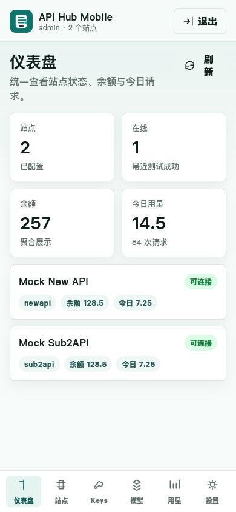
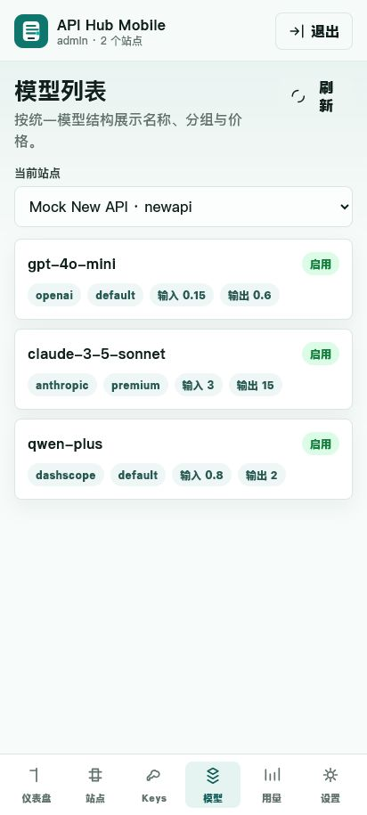

# API Hub Mobile

[English](README.md) | [中文](README.zh-CN.md)

API Hub Mobile is a mobile-first Web/PWA for managing [New API](https://github.com/QuantumNous/new-api), Sub2API / simple-one-api style services, and OpenAI-compatible API gateways through a private backend proxy.

It is built for users who manage API accounts from a phone: check site health, inspect balance and usage, browse models, and manage API keys without exposing remote credentials in the browser.

## Highlights

- **Mobile-first PWA**: optimized for iOS Safari and Android Chrome, with manifest, service worker, and safe-area layout.
- **New API and Sub2API adapters**: supports site management, automatic route detection, connection tests, key/token management, model lists, model price comparison, usage summaries, and usage logs where the remote site exposes them.
- **Backend credential proxy**: remote tokens, JWTs, API keys, and admin tokens are encrypted on the backend and injected only during proxy requests.
- **No plaintext secrets in frontend storage**: the browser does not store remote credentials in `localStorage` or `sessionStorage`.
- **Single-user admin login**: HttpOnly cookie session, password change, and generated initial password.
- **API credential library**: separately manage OpenAI-compatible API keys for model validation and future client-export workflows.
- **Docker Compose support**: run the app with a persistent data volume and environment-based secrets.

## Screenshots

| iOS Safari 390px | Android Chrome 412px |
| --- | --- |
|  |  |

## What It Can Do

| Area | Implemented |
| --- | --- |
| Authentication | Single-user login, HttpOnly cookie session, password change |
| Site management | Create, edit, delete, enable/disable, automatic detection, connection test, diagnostics |
| New API | User access token + user ID proxy injection, token list/create/delete, model list, balance, usage, usage logs |
| Sub2API | Auth Token / JWT, API Key, Admin Token, Cookie, and Refresh Token proxy injection; key list/create/delete, model list, usage where permissions allow |
| Dashboard | Site count, online state, balance, today's usage, request count, today's token count |
| API keys | Masked list, one-time plaintext create result, delete confirmation |
| API credential library | Store OpenAI-compatible API keys separately, test `/v1/models`, inspect reachable models |
| Models | Normalized name, provider, group, input/output price, estimated price source, enabled state |
| Usage | Balance, today's usage, total usage, today's request count, today's prompt/completion token count, recent usage logs |
| PWA | Manifest, service worker, mobile navigation, install support |
| Security | AES-GCM encrypted credentials, ignored local data directory, secure-cookie option |
| Deployment | Node.js runtime, Docker image, Docker Compose |

## Quick Start

### Docker Compose

```bash
cp .env.example .env
```

Edit `.env`, then run:

```bash
docker compose up -d --build
```

Open:

```text
http://localhost:4173
```

### Node.js

```bash
node server.js
```

If `APIHUB_ADMIN_PASSWORD` is not set on first start, the app generates a random initial password and writes it to:

```text
data/initial-admin-password.txt
```

For Docker Compose, set `APIHUB_ADMIN_PASSWORD` and `APIHUB_SECRET` in `.env`; the compose file requires both values.

## Production Example

```bash
APIHUB_ADMIN_USER=admin \
APIHUB_ADMIN_PASSWORD=your-strong-password \
APIHUB_SECRET=your-32-byte-or-longer-secret \
APIHUB_COOKIE_SECURE=true \
APIHUB_ENABLE_MOCKS=false \
node server.js
```

See [DEPLOYMENT.md](DEPLOYMENT.md) for Docker, Compose, and reverse proxy details.

## Credential Notes

### New API

Use the New API user access token and user ID from the remote New API site. This is not the `sk-...` API key used by OpenAI-compatible clients.

### Sub2API

Sub2API deployments vary a lot. Start with the weakest credential that works, then add stronger credentials only when needed:

- `API Key`: usually enough for `/v1/models` and OpenAI-compatible calls, but often not enough for balance, logs, or account statistics.
- `Auth Token / JWT`: the access token stored by the original Sub2API frontend, often named `auth_token` in Local Storage. This is the best choice for user-level balance, usage, and key management.
- `Refresh Token`: often named `refresh_token`. API Hub Mobile exchanges it through `/api/v1/auth/refresh`, uses the returned access token, and stores rotated refresh tokens encrypted on the backend.
- `Cookie`: copy the logged-in Cookie string from the original Sub2API site when the deployment uses cookie sessions.
- `Admin Token`: use only for deployments that expose administrative management APIs.

Never paste plaintext tokens into issues, pull requests, or screenshots.

## Architecture

```text
Mobile Browser / PWA
        |
        v
Static Web UI
        |
        v
API Hub Mobile Backend
  - session management
  - encrypted credential storage
  - adapter route mapping
  - credential injection
        |
        v
New API / Sub2API / OpenAI-compatible Gateway
```

## Security Model

- Admin login uses an HttpOnly cookie.
- Site credentials are encrypted with AES-GCM before being written to `data/store.json`.
- The browser receives masked credentials only.
- New API access tokens, Sub2API auth tokens/JWTs, refresh tokens, cookies, API keys, and admin tokens are never embedded in frontend source code.
- `data/`, `.env*`, logs, and local verification screenshots are ignored by Git.
- Set `APIHUB_COOKIE_SECURE=true` when serving over HTTPS.

See [SECURITY.md](SECURITY.md) for more details.

## Disclaimer

API Hub Mobile is an independent open-source project. It is not affiliated with, endorsed by, or officially maintained by New API, Sub2API, simple-one-api, all-api-hub, OpenAI, or any API service provider mentioned in this repository.

This project is provided for learning, self-hosting, and lawful API account management. You are responsible for complying with the terms of service, security policies, quota rules, and applicable laws of the remote services you connect. The maintainers are not responsible for service interruptions, data loss, credential misuse, billing disputes, or any consequences caused by improper deployment or use.

## References and Compatibility

API Hub Mobile is not a fork of New API or Sub2API and does not copy their source code. It implements a mobile management layer around common use cases and API shapes from:

- [New API](https://github.com/QuantumNous/new-api)
- [Sub2API / simple-one-api](https://github.com/fruitbars/simple-one-api)
- [all-api-hub](https://github.com/qixing-jk/all-api-hub)
- OpenAI-compatible API gateways, including common routes such as `/v1/models`

See [docs/REFERENCES.md](docs/REFERENCES.md) for compatibility notes.

## Acknowledgements

Thanks to the open-source projects and communities that made this project possible:

- [New API](https://github.com/QuantumNous/new-api): for the OpenAI-compatible distribution and management scenarios that API Hub Mobile adapts to.
- [simple-one-api / Sub2API ecosystem](https://github.com/fruitbars/simple-one-api): for Sub2API-style key, model, quota, and usage management patterns.
- [all-api-hub](https://github.com/qixing-jk/all-api-hub): for product ideas around multi-account asset management, model comparison, browser-session workflows, and usage analysis.
- OpenAI-compatible gateway projects and API management tools: for the common `/v1/models`, key management, and usage-reporting conventions used across the ecosystem.

API Hub Mobile only references public behavior, API shapes, and product ideas from these projects. It does not vendor or copy their source code.

## Documentation

- [Deployment Guide](DEPLOYMENT.md)
- [User Guide](docs/en-US/USER_GUIDE.md)
- [Testing Guide](TESTING.md)
- [中文说明](README.zh-CN.md)
- [中文使用指南](docs/zh-CN/USER_GUIDE.md)
- [Security Policy](SECURITY.md)
- [Contributing Guide](CONTRIBUTING.md)

## Development Checks

```bash
node --check server.js
node --check public/app.js
```

## License

[MIT](LICENSE)
